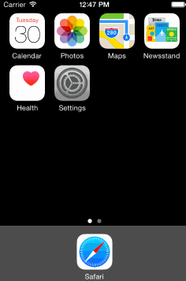

#SkyWaitingView

-----
##测试环境：Xcode 6，iOS 7.0以上。

##简介
一个简单的等待指示器

* 可自定义圆弧粗细、颜色、旋转速率
* 可自定义标签显示

-----
##使用方法
把头文件 `SkyWaitingView.h` 导入项目，然后设置各属性，具体使用方法请参考示例项目。

```objc
SkyCircleWatingView *v = [SkyCircleWatingView new];
v.frame = CGRectMake(50, baseY, 0, 0);
[v sizeToFit];
[self.view addSubview:v];
v.rate = 1.f;
[v start];
```

-----
##关于我
* 一枚普通的即将大三的珠海大学生
* 希望大三实习、毕业的工作地方都在珠海

-----
##联系方式
* QQ：875766917，请备注
* QQMail：875766917@qq.com